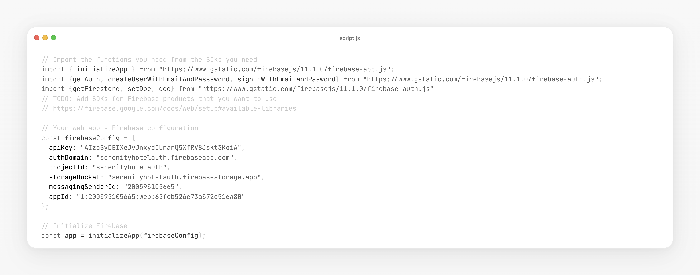
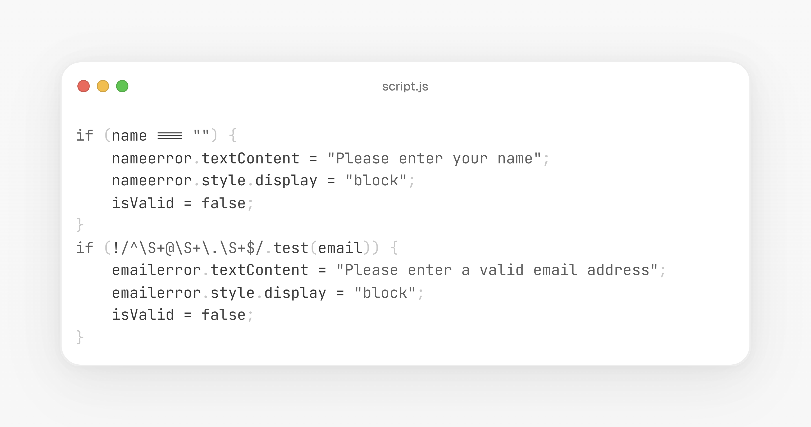

<!-- # Serenity Haven Hotel Landing Page

Welcome to the **Serenity Haven Hotel** webpage! This project showcases a responsive and immersive layout, offering users a seamless experience to explore our services, book tours, and get in touch with us. 

## 🌟 Features

- **Modern Design**: Designed with clean layouts and user-friendly navigation.
- **Responsive Web Design**: Fully adaptable to various screen sizes using **Bootstrap 5**.
- **Interactive Components**:
  - Navigation bar with dropdown menus.
  - Accordions for information display.
  - Modals for interactive pop-ups.
- **HTML5 Forms**: Functional and visually appealing forms.
- **Grid System**: Effective content arrangement for a polished look.

## 📂 File Structure

- `index5.html`: The main landing page highlighting hotel features and services.
- `about.html`: Dedicated page sharing the hotel's story and values.
- `tour.html`: A tour booking page showcasing available packages.
- `assets/`: Contains images, CSS, and other resources to enhance the visual experience.

## 💡 Technology Stack

- **HTML5**: For semantic and structured content.
- **CSS**: Used alongside Bootstrap 5 for styling and responsiveness.
- **JavaScript**: Enables dynamic interactions like modals and accordions.

## 📸 Screenshots

### Landing Page Preview
.png)

### About Page
.png)

### Tour Booking
.png)


## 🚀 Live Demo

Explore the live demo: [Serenity Haven Hotel](https://lawani-ej.github.io/landing-page/index5.html)

## 🔧 Setup Instructions

1. Clone the repository:
   ```bash
   git clone https://github.com/Lawani-EJ/Landing-Page.git
   ```
2. Navigate to the project directory:
   ```bash
   cd Landing-Page
   ```
3. Open `index5.html` in your browser to view the landing page.

--- -->

## Features Added Today

### Firebase Authentication and Form Validation



#### Firebase Authentication
- User Registration
  - Initializes Firebase using the provided Firebase configuration.
  - Allows users to register with email and password.

- User Login
  - Validating user credentials against firebase authentication.


## Features

### Firebase Authentication
- **User Registration**
  - Initializes Firebase using the provided Firebase configuration.
  - Allows users to register with email and password.

- **User Login**
  - Validates user credentials against Firebase Authentication.

## Tools and Technologies

- **Firebase**
  - Firebase SDK for Authentication.
  - Firestore for potential data storage.

# Firebase Authentication and Form Validation Project

This project demonstrates the implementation of Firebase Authentication for user registration and login functionalities, as well as client-side form validation for secure and user-friendly interactions.


### Form Validation


- **Signup Form Validation**
  - Validates input fields (name, email, password, and confirm password).
  - Checks for valid email format.
  - Ensures password length is at least 8 characters.
  - Verifies that the password and confirm password fields match.

- **Login Form Validation**
  - Validates email format.
  - Checks that the password length meets the required minimum.

- **Error Display**
  - Displays specific error messages for invalid inputs.
  - Hides error messages when inputs are corrected.

### Additional Features
- **Toggle Password Visibility**
  - Allows users to toggle between showing and hiding their passwords for convenience.


<!-- 
### Signup Form
- Collects user information such as:
  - Full Name
  - Email Address
  - Password
  - Password Confirmation
- Includes:
  - Password visibility toggle
  - Required field validation

### Login Form
- Allows users to log in using their:
  - Email Address
  - Password
- Features:
  - Password visibility toggle
  - Required field validation

## Screenshots

### Signup Form
.png)

### Login Form
.png)

## Technologies Used
- **HTML5**: For structuring the forms.
- **CSS3**: Custom styling for a modern and user-friendly appearance.
- **Bootstrap 5**: Ensuring responsiveness and ease of layout management.
- **JavaScript**: To enable the password visibility toggle functionality.

## Future Improvements
- Backend integration for authentication.
- Add "Forgot Password" functionality.
- Mobile-first enhancements for smaller screens.

## Contributing
Feel free to fork the repository and submit pull requests with improvements or new features.

## License
This project is licensed under the MIT License. See the `LICENSE` file for more details. -->

---

